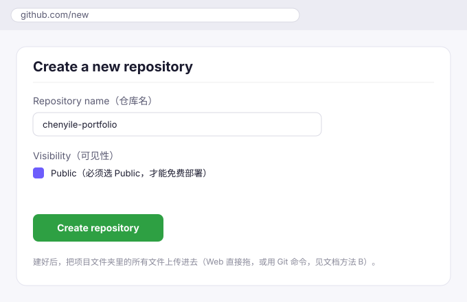
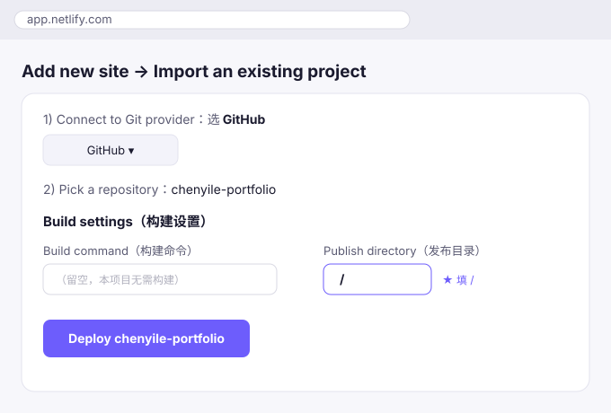
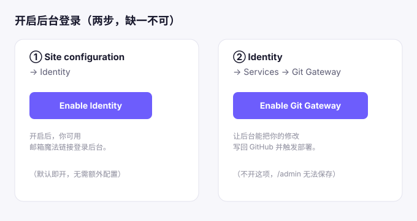
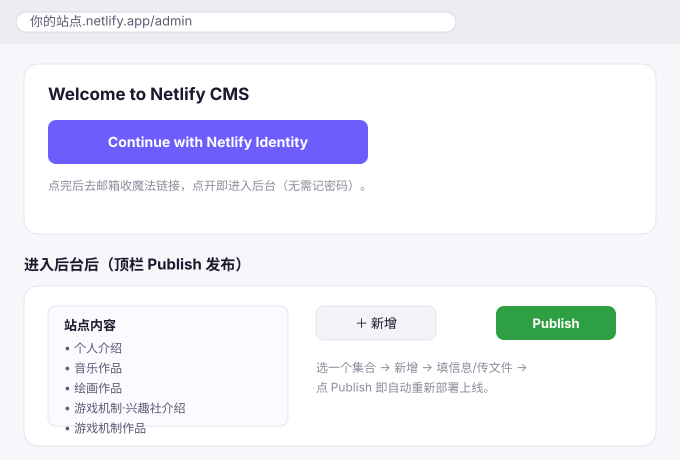

# Netlify 部署详细指南（含网页后台 /admin）

> **目标**：把作品集部署到公网 + 开启网页后台，以后登录 `/admin` 点几下就能上传音乐和图片。
> **适用**：第一次用 Netlify、没写过代码也能照着做。全程免费。预计耗时 15–20 分钟。
> **前置**：已有一个 GitHub 账号（没有就去 [github.com](https://github.com) 免费注册）。
> 本指南对应 `README.md` 第四节的「方案 B」。下方每步都配了**界面示意图**（标出按钮位置和该填什么）。

---

## 准备清单

- [ ] GitHub 账号可用
- [ ] 本机项目文件夹 `2026-09-13-21-15-58`（含 `index.html`、`assets/`、`admin/` 等）已就绪
- [ ] 网络能正常访问 github.com 与 app.netlify.com

---

## 第一步：建 GitHub 仓库并上传文件

打开 [github.com/new](https://github.com/new)，按下图填写：



1. **Repository name（仓库名）**：填一个好记的英文，例如 `chenyile-portfolio`。
2. **Visibility**：必须选 **Public**（公开）。私有仓库 Netlify 免费版也能连，但公开最简单、零误会。
3. **不要**勾选 "Add a README file" / "Add .gitignore"（你的文件夹里已经有了，避免冲突）。
4. 点绿色 **Create repository**。

建好后，把项目文件夹里的**所有内容**上传进去。两种办法任选：

### 方法 A：网页直接拖（最省事，不用装 Git）
进到刚建好的空仓库页面，把项目文件夹 `2026-09-13-21-15-58` 里的所有文件和文件夹**整体拖到页面的上传区**（GitHub 支持拖文件夹并保留目录结构）。拖完在底部写提交说明 `init portfolio`，点 **Commit changes**。

### 方法 B：用 Git 命令（推荐，以后更新也用它）
在**项目文件夹**里打开终端（Windows 可用 Git Bash），执行：

```bash
git init
git add .
git commit -m "init portfolio"
git branch -M main
git remote add origin https://github.com/你的用户名/chenyile-portfolio.git
git push -u origin main
```

> 仓库创建成功页会直接给你这一段命令，复制来改改用户名即可，更省心。

---

## 第二步：Netlify 导入这个仓库

打开 [app.netlify.com](https://app.netlify.com)（用 GitHub 账号登录），按下图操作：



1. 点 **Add new site → Import an existing project**。
2. **Connect to Git provider**：选 **GitHub**（首次会弹窗授权，点 Authorize 允许）。
3. **Pick a repository**：在列表里选刚才建的 `chenyile-portfolio`。
4. **Build settings（构建设置）**——这步最关键，只改两处：
   - **Build command（构建命令）**：**留空**（本项目是纯静态，不需要构建）。
   - **Publish directory（发布目录）**：填 **`/`**（根目录，因为 `index.html` 就在最外层）。
5. 点 **Deploy chenyile-portfolio**。

---

## 第三步：等部署，拿到公网地址

点 Deploy 后页面会跳到站点详情，顶部出现 **Site deploy in progress…**。
等约 1 分钟变成 **Published**，旁边就会显示一个地址，形如：

```
https://xxxx.netlify.app
```

这就是你的**公网地址**，任何人都能打开。先点进去看看，应该已经是活力风的作品集了。
（想要自己的域名如 `chenyile.art`？见 `README.md` 第四节「自定义域名 + DNS + HTTPS」。）

---

## 第四步：开启 Identity（后台登录开关）



进到你的站点，左侧 **Site configuration → Identity**：

1. 右上角点 **Enable Identity**（紫色按钮）。
2. 开启后默认就是「邮箱魔法链接登录」，**无需额外配置**。

> Identity 负责「谁能登录后台」。不开它，`/admin` 进不去。

---

## 第五步：开启 Git Gateway（后台写回仓库的开关）

同一个 Identity 页面里，切到 **Services** 标签 → **Git Gateway**：

1. 点 **Enable Git Gateway**（紫色按钮）。

> Git Gateway 负责「后台保存的修改能写回 GitHub 并触发重新部署」。**不开这项，`/admin` 里改了内容也存不回去**——这是最容易漏的一步。

---

## 第六步：把自己加为后台用户

仍在 **Identity** 页面：

- **方式一（推荐）Invite users**：点 **Invite users**，输入你的邮箱 → 去邮箱点确认链接，设置一下即可登录。
- **方式二 Open 注册**：若想自己随时注册，把 **Identity → Registration** 设为 **Open**，之后任何人都能用邮箱注册登录（个人作品集小站也行，但建议用方式一更可控）。

---

## 第七步：登录后台 /admin

打开下面的地址（把 `xxxx` 换成你第三步拿到的站点名）：

```
https://xxxx.netlify.app/admin
```



1. 进入后点 **Continue with Netlify Identity**。
2. 去邮箱收一封魔法链接邮件，点开链接即自动进入后台，**无需记密码**。

> 若绑定了自定义域名，地址就是 `https://你的域名/admin`。

---

## 第八步：第一次发布（验证后台可用）

进后台后你会看到左侧集合「站点内容」，展开有五类：
**个人介绍 / 音乐作品 / 绘画作品 / 游戏机制·兴趣社介绍 / 游戏机制作品**。

1. 随便点开一个（比如「个人介绍」），确认能看到你填的内容。
2. 想发新作品：选「音乐作品」或「游戏机制作品」→ 点 **＋ 新增** → 填信息、用「封面图 / 音频文件 / 图片」字段上传文件 → 保存。
3. 改完点右上角 **Publish**，Netlify 自动重新构建，约 **1–2 分钟**后公网更新。

> 以后日常上传就只做这一步，详见 `更新作品说明书.md`。

---

## 常见问题（部署阶段）

- **Deploy 一直卡在 building / 失败？**
  看部署日志（站点 **Deploys** 里点那次部署）。最常见原因：Publish directory 没填 `/`、或仓库是空的。确认第二步设置正确、文件已 push 成功。
- **打开 `xxxx.netlify.app` 是空白 / 样式乱？**
  多半是文件没传全（尤其 `assets/` 文件夹）。回到 GitHub 仓库确认 `index.html` 和 `assets` 是同级目录。
- **`/admin` 提示 "No Git Gateway"？**
  回头做**第五步**开启 Git Gateway。
- **登录收不到魔法链接邮件？**
  检查垃圾邮件；或把 Identity Registration 设为 Open 自行注册；确认第六步邀请的邮箱拼写正确。
- **后台改了内容，公网没变？**
  静态站有缓存，强制刷新（Ctrl/Cmd+Shift+R）；部署本身有 1–2 分钟延迟，去 Netlify **Deploys** 看是否 Published。

---

## 一句话回顾

建 GitHub 仓库 → 上传文件 → Netlify 导入（Build 留空 / Publish 填 `/`）→ 拿到 `xxxx.netlify.app` → 开 Identity → 开 Git Gateway → 邀请自己 → 登录 `/admin` → Publish。
